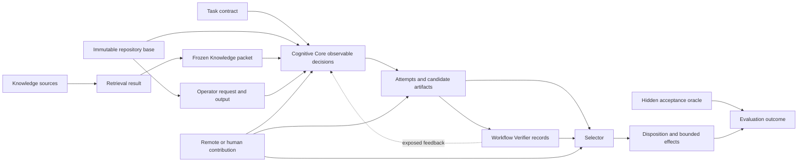

# Intervention-Supported Attribution — Bounded Experiment Design

- Date: 2026-08-17
- Scope: design-only bounded experiment specification
- Authorizing decision: [Issue #33](https://github.com/chlangjou/Dexinode/issues/33)
- Base state: `main@174b235fed6ac69a20c285c4a0cb2829d09d28a9`
- Feasibility basis: [Cognitive Decomposition Attribution Feasibility Review](2026-08-17-cognitive-decomposition-attribution-feasibility-review.md)
- Architecture decision: [ADR 0003](../decisions/0003-resource-bounded-verifiable-execution-fabric.md)
- Current bounded architecture: [Repository-Repair Verifiable Execution Fabric Specification v0.2](../specifications/bounded-repository-repair-verifiable-execution-v0.2.md)
- Recommendation: **`PROCEED TO GATE SPECIFICATION`**
- Experimental authorization: **none**

This document specifies a candidate experiment design. It does not create a Gate, freeze benchmark cases, select a model, implement a repository or harness, set numerical acceptance thresholds, or authorize execution.

## Executive conclusion

A bounded attribution experiment is design-feasible, but the first Gate should be narrower than an autonomous AI failure-diagnosis test.

The first falsifiable question should be:

> **Can one synthetic, repository-local migration workflow provide sufficiently faithful receipts, controlled fault boundaries, prefix／state-preserving replay, independent oracles, and negative controls to support correct `E3 SUFFICIENCY-SUPPORTED` set-valued attribution records for predeclared `K`／`O`／`C`／`V` faults and `P` provenance conditions?**

This candidate Gate would calibrate the **attribution contract and evidence machinery**. It would not yet claim that a learned Cognitive Core or attribution model can autonomously discover the right intervention.

The design deliberately separates two future stages:

1. **Attribution Contract Calibration** — known fault manifests, controlled interventions, receipts, replay, oracle outcomes, and evidence grades. This is the only stage recommended for the next Gate specification.
2. **Automatic Attribution Policy Evaluation** — a learned or rule-based policy proposes hypotheses and interventions without seeing the fault manifest. This requires a later decision and should not proceed unless the contract-calibration Gate succeeds.

The selected scenario family is a synthetic or repository-local **versioned client API plus configuration migration**. It is rich enough to exercise Knowledge, Operator, Core integration, Verification／Selection, and provenance, while remaining deterministic, replayable, reversible, and resistant to pretraining leakage.

## 1. Claim and unit of analysis

### 1.1 Candidate Gate claim

The proposed next Gate should test only whether the workflow can produce valid intervention evidence for a known controlled fault boundary.

A positive result would support:

> Under the pinned synthetic workflow and predeclared intervention set, the control-plane receipts and replay protocol can establish that one or more component-level corrections were sufficient to change a verified outcome, while preserving causal roles, provenance, and unresolved alternatives.

It would **not** support:

- one unique root cause exists for every failure;
- the recorded component is the earliest or universally minimal cause;
- an LLM explanation reveals its internal reason;
- a selected Cognitive Core can diagnose arbitrary real-world repositories;
- the attribution framework generalizes to concurrency, distributed systems, open-ended requirements, or networked providers;
- the Cognitive Decomposition Hypothesis is validated end to end.

### 1.2 Units

| Unit | Definition |
|---|---|
| **Scenario template** | One abstract migration family defining the repository roles, v1 and v2 contracts, semantic invariants, tool interfaces, and hidden oracle. |
| **Fixture** | One concrete immutable repository instance generated from the scenario template. A fixture is not yet selected or frozen by this design. |
| **Condition** | A clean or fault-injected configuration of one fixture, including the fault manifest and exposed workflow Verifier. |
| **Run** | One complete execution under a pinned Local Decision Configuration, condition, policy, environment, and budget. |
| **Attempt** | One bounded candidate-generation and verification path inside a run. |
| **Candidate set** | The closed set of candidate artifacts available to the Selector for one decision point. |
| **Intervention** | One predeclared correction, removal, replacement, or no-op applied at an observable causal boundary. |
| **Replay** | A rerun from a preserved boundary with an intervention while holding the declared prefix and non-target variables fixed. |
| **Attribution record** | A structured claim binding component family, causal role, evidence grade, intervention, receipts, before／after outcomes, alternatives, and limitations. |

### 1.3 Permitted causal language

| Evidence grade | Permitted statement |
|---|---|
| `E0 NARRATIVE` | “The model／human suspects …” |
| `E1 OBSERVATIONAL` | “The trace is consistent with …”; “candidate locus …” |
| `E2 CONTROLLED-NO-FLIP` | “The matched intervention did not establish sufficiency.” |
| `E3 SUFFICIENCY-SUPPORTED` | “This intervention was sufficient to change／recover the verified outcome under the pinned configuration and replay contract.” |
| `E4 LIMITED MINIMALITY／NECESSITY` | “Within the predeclared intervention set, this condition was necessary or no smaller admissible intervention sufficed.” |

Prohibited by default:

- “the unique root cause”;
- “the model internally failed because …”;
- “this component is always necessary”;
- “the earliest cause” unless the modeled graph and intervention evidence establish that limited claim;
- any inference from private chain-of-thought or unverified rationale.

## 2. Workflow and synthetic system boundary

### 2.1 Scenario family

The experiment-design family is a repository-local client migration from a fictional **Relay API v1** to **Relay API v2**, accompanied by a versioned configuration schema.

Conceptual v1 interface:

```text
publish(topic, payload)
```

Conceptual v2 interface:

```text
publish(PublishRequest {
  channel,
  body,
  tenant,
  codec
})
```

The repository-local v2 contract defines several semantic invariants:

1. `channel` preserves the v1 topic value.
2. `body` preserves the original payload.
3. `tenant` must come from versioned repository configuration; it must not be hard-coded.
4. `codec` must come from v2 configuration or the documented v2 default.
5. publish errors must be propagated rather than silently discarded.
6. all v1 call sites and deprecated v1 configuration fields must be removed.

A fixture may contain several call sites, one wrapper, one configuration file, and deterministic tests. The exact number, language, file layout, and case set remain unfrozen.

### 2.2 Why this family is attribution-friendly

- **Knowledge is externalizable and versioned.** v1 documentation, v2 documentation, migration guide, config schema, and deprecation notice can be absent, stale, conflicting, correct, or omitted during packet compilation.
- **Operator outputs can have deterministic oracles.** A schema inspector or migration analyzer can return typed field mappings and call-site inventories whose correctness is checked independently.
- **Core integration is bounded but non-trivial.** The Core must combine documentation, configuration, call sites, Operator outputs, error-handling rules, and task constraints across files.
- **Verifier coverage can be varied.** Compile-only, schema-only, partial semantic, complete semantic, false-positive, and false-negative conditions are possible.
- **Selector behavior is observable.** Several preconstructed candidates may form a closed set with known oracle status.
- **Provenance can be injected.** Remote or human contributions can be disclosed, hidden, misattributed, unused, or policy-invalid.
- **The final state is reversible.** All patches remain in isolated sandboxes against an immutable base.

### 2.3 Resistance to parametric-knowledge leakage

The API and field names should be repository-local and fictional. Migration semantics should be generated specifically for the experiment and unavailable in public package documentation.

The design does not assume zero training leakage is provable. It reduces the confounder by requiring:

- fictional identifiers and rules;
- repository-local versioned sources;
- migration relationships not copied from a public API;
- hidden semantic checks derived from the private fixture contract;
- contrast conditions where contextual Knowledge intentionally conflicts with plausible generic conventions.

### 2.4 Unsupported first-stage tasks

The first candidate Gate should exclude:

- arbitrary repository issues;
- concurrency and timing-dependent failures;
- distributed services or external live APIs;
- open-ended architectural refactors;
- security claims requiring adversarial model behavior;
- natural-language quality without an independent acceptance boundary;
- network federation, marketplace, reputation, or settlement;
- latent-state or J-Space-level attribution;
- model-internal neural causal claims.

## 3. Causal graph and intervention variables

### 3.1 Observable causal skeleton



The hidden oracle evaluates; it must not influence the normal workflow before terminal disposition.

### 3.2 Variables by family

#### `K` — Knowledge supply

- source identity and revision;
- source validity interval and trust;
- retrieval query and retrieved set;
- conflict set;
- packet compiler revision;
- frozen packet bytes／tokens and hash;
- omitted or summarized items;
- delivery to the Core interface.

#### `O` — Operator capability

- exact request and schema;
- Operator identity, revision, runtime, and policy;
- availability／refusal／timeout;
- schema validity;
- semantic correctness relative to an independent Operator oracle;
- output confidence and limitations when applicable.

#### `C` — Cognitive Core boundary

Only observable decisions are in scope:

- request for clarification or additional context;
- task decomposition;
- interpretation of migration rules;
- plan and typed intermediate claims;
- candidate-generation instruction or candidate artifact;
- acceptance, rejection, abstention, stopping, retry, or escalation request.

Private reasoning and model-internal activations are out of scope.

#### `V` — Verification／Selection

- exposed workflow Verifier revision, scope, coverage, environment, result, and feedback;
- candidate eligibility;
- closed candidate set;
- Selector policy, records consumed, ranking, and disposition;
- terminal acceptance or false rejection.

#### `P` — Provenance and substitution integrity

- Remote／human identity and role;
- exact disclosed packet or artifact;
- edits, selections, approvals, and takeovers;
- authority and policy;
- whether the contribution was used;
- whether the final contribution record is complete and accurate.

### 3.3 Mediators and interaction terms

The design must preserve that:

- `K` can affect `C`, which affects candidates;
- `O` output can be accepted, rejected, or transformed by `C`;
- `V` feedback can alter later attempts and therefore becomes part of the candidate lineage;
- `P` may recover a semantic fault without itself being a provenance fault;
- a `V` false negative can permit an earlier `K`, `O`, or `C` fault to escape;
- the Selector may fail even when all Verifier records are accurate;
- conditioning only on accepted candidates creates selection bias.

### 3.4 Variables not claimed to be isolated

The first design should not claim to isolate:

- model-internal retrieval versus parametric recall;
- individual neural circuits;
- the earliest internal thought that led to an observable Core decision;
- human intent outside instrumented edits and approvals;
- hidden Remote access when the system does not technically mediate all network and tool paths;
- universal minimal causes outside the predeclared intervention set.

## 4. Calibration condition matrix

The exact fixture count and case count remain unfrozen. The Gate specification should freeze a balanced condition manifest only after static validation.

### 4.1 Clean reference

| Code | Condition | Expected behavior |
|---|---|---|
| `R0` | Correct v2 sources, complete packet, oracle-valid Operator output, correct Core boundary decisions, complete workflow Verifier, valid Selector policy, no hidden contribution | Valid migration candidate; no semantic attribution record above `E1`; no provenance fault. |

The clean reference must be stable enough to support matched replay. If it is not, the experiment is blocked.

### 4.2 Single-fault calibration conditions

#### Knowledge

| Code | Fault | Intended boundary |
|---|---|---|
| `K1` | v2 migration guide absent from retrieval result | retrieval／Knowledge availability |
| `K2` | stale v1 guide is falsely marked current | source revision／validity |
| `K3` | correct v2 sources are retrieved, but the packet compiler omits the `tenant` rule | packet compilation／delivery |
| `K4` | v1 and v2 rules conflict and provenance is present, but no conflict is surfaced in the packet | conflict preservation |

#### Operator

| Code | Fault | Intended boundary |
|---|---|---|
| `O1` | required migration analyzer is unavailable or refuses | capability availability |
| `O2` | Operator returns schema-invalid typed output | contract validity |
| `O3` | Operator returns a schema-valid but semantically wrong field mapping | semantic Operator output |

#### Cognitive Core

The Core family requires positive upstream sufficiency evidence. Controlled `C` calibration therefore injects faults at observable Core decision artifacts while all `K` and `O` inputs remain oracle-valid.

| Code | Fault | Intended boundary |
|---|---|---|
| `C1` | typed migration plan swaps or omits a required v2 mapping despite correct Knowledge and Operator output | interpretation／integration |
| `C2` | Core observable decision ignores an explicit valid Operator warning and proceeds with an invalid candidate plan | integration／judgment |
| `C3` | Core fails to stop or escalate after an observable hard precondition states that automatic completion is not permitted | stopping／escalation |

These conditions calibrate the **Core interface attribution boundary**, not the internal neural cause of the faulty decision.

#### Verification／Selection

| Code | Fault | Intended boundary |
|---|---|---|
| `V1` | exposed workflow Verifier checks compile and schema but is blind to a required semantic invariant | Verifier coverage／false acceptance |
| `V2` | Verifier emits an incorrect positive record for an oracle-invalid candidate | Verifier false positive |
| `V3` | closed candidate set contains one oracle-valid candidate, but Selector chooses a known inferior or ineligible candidate using accurate records | Selector failure |
| `V4` | correct candidate is rejected by an incorrect negative Verifier record | Verifier false negative／false rejection |

### 4.3 Provenance conditions

| Code | Condition | Expected interpretation |
|---|---|---|
| `P0` | Remote contribution is authorized, disclosed, task-scoped, and accurately attributed | valid configuration contribution; no `P` fault |
| `P1` | Human edit is authorized, disclosed, and accurately attributed | valid human substitution; no `P` fault |
| `P2` | Remote candidate or plan materially affects the result but is omitted or attributed to the Local Core | provenance-integrity fault |
| `P3` | Human correction materially changes the artifact but the final receipt claims autonomous completion | provenance-integrity fault |
| `P4` | A disclosed Remote artifact is present but not used by any accepted candidate | negative control; no material substitution attribution |

### 4.4 Limited two-fault cascades

Only a small, predeclared set should be used in the first Gate. Their purpose is to test set-valued records and causal roles, not exhaustive interaction discovery.

| Code | Cascade | Expected role structure |
|---|---|---|
| `M1` | stale Knowledge (`K2`) + blind workflow Verifier (`V1`) | `K initiating`; `V detection／terminal_acceptance` if the fault escapes |
| `M2` | semantically wrong Operator output (`O3`) + Core accepts it despite an explicit inconsistency (`C2`) | `O initiating`; `C propagating`; later Verifier role as observed |
| `M3` | Core plan defect (`C1`) + blind workflow Verifier (`V1`) | `C initiating`; `V detection／terminal_acceptance` |
| `M4` | missing Knowledge (`K1`) + authorized disclosed human correction (`P1`) | `K initiating`; human `recovery` contribution; no `P` integrity fault |
| `M5` | oracle-valid final artifact supplied by hidden Remote contribution (`P2`) | semantic success plus provenance-integrity failure |

### 4.5 Negative controls and no-op interventions

At minimum, the Gate specification should include:

- replacing a correct Knowledge source with a byte-different but semantically equivalent source;
- reissuing an Operator output with identical semantic content and a new receipt ID;
- adding irrelevant but non-conflicting context;
- declaring an authorized Remote contribution that is never consumed;
- replaying from the same boundary with an identity transformation;
- changing a Verifier receipt's non-semantic metadata while preserving revision, scope, and result.

A no-op condition that frequently produces outcome flips invalidates the replay contract.

### 4.6 Intentionally excluded conditions

Do not include in the first calibration Gate:

- faults requiring unverifiable natural-language intent;
- simultaneous changes to model, Knowledge, Operator, and Verifier;
- fault conditions whose correction necessarily changes the task contract;
- ambiguous human edits outside instrumented boundaries;
- stochastic external services;
- faults for which no independent semantic oracle exists.

## 5. Replay and counterfactual protocol

### 5.1 Replay boundaries

The implementation specification should preserve snapshots at these logical boundaries:

| Boundary | Preserved state |
|---|---|
| `B0` | task contract, immutable repository, environment, configuration identity |
| `B1` | retrieved sources and frozen Knowledge packet |
| `B2` | Operator request／output set |
| `B3` | Core observable plan／intermediate decision |
| `B4` | closed attempt and candidate set |
| `B5` | workflow Verifier receipts and feedback exposure |
| `B6` | Selector disposition before any durable external effect |

An intervention targets exactly one declared boundary unless the condition is a predeclared cascade.

### 5.2 Replay fidelity classes

| Class | Meaning | Maximum evidence grade |
|---|---|---|
| `RF0` | independent rerun with material configuration drift | `E0` |
| `RF1` | same configuration identity but no preserved prefix／state | `E1` |
| `RF2` | exact prefix and upstream receipts preserved through the target boundary; target replaced; downstream replayed | eligible for `E3` if the hidden oracle flips |
| `RF3` | `RF2` plus deterministic or receipt-pinned unaffected downstream components, making the changed variable set explicit | eligible for `E3` and limited `E4` within the predeclared intervention set |

Independent stochastic samples may estimate variability, but they do not become causal evidence merely through repetition.

### 5.3 Intervention types

- **Correction:** replace a known-invalid artifact with the oracle-valid counterpart.
- **Removal:** remove a suspected input or contribution while preserving the remaining state.
- **Replacement:** swap one component output or policy for a predeclared contrast.
- **No-op:** change identity or serialization while preserving semantic content.
- **Exposure control:** change whether detailed workflow Verifier feedback is available to later attempts.

Every intervention record must enumerate:

- target variable;
- before and after artifact hashes;
- held-constant variables;
- replay boundary and fidelity class;
- expected causal contrast;
- actual before／after hidden-oracle result;
- cost and execution differences;
- deviations from the protocol.

### 5.4 Outcome classes

| Outcome | Definition |
|---|---|
| `FULL_FLIP` | terminal hidden-oracle outcome changes from invalid to valid or valid to invalid under a faithful replay |
| `PARTIAL_RECOVERY` | an intermediate or subset oracle improves, but the final hidden oracle does not become valid |
| `NO_FLIP` | faithful replay completes and the relevant oracle does not change |
| `NON_FAITHFUL_REPLAY` | declared non-target state drifted or the target intervention could not be isolated |
| `UNRESOLVED` | replay or oracle evidence is insufficient for a supported claim |

Only `FULL_FLIP` under `RF2`／`RF3` supports `E3` for the targeted intervention. Partial recovery can support a causal-role claim at an intermediate boundary, but not terminal sufficiency.

### 5.5 Adaptive Verifier feedback

Every attempt must record which Verifier details were exposed.

A candidate repaired after detailed feedback may be accepted operationally, but the record must distinguish:

- untouched hidden-oracle evidence;
- exposed workflow-Verifier recovery evidence;
- repeated adaptive exposure;
- candidate lineage derived from prior failures.

A later pass must not be represented as independent held-out evidence when the generator saw the failing checks.

## 6. Receipt and observability contract

### 6.1 Required receipt objects

| Receipt | Required minimum fields |
|---|---|
| `task_receipt` | task ID, exact contract, non-goals, authority, expected artifact, acceptance boundary, hash |
| `base_receipt` | repository revision, environment, dependencies, fixture identity, mutable／immutable paths |
| `knowledge_receipt` | source IDs／revisions, validity, trust, query, retrieved set, conflicts, frozen packet hash, omissions, compiler revision |
| `operator_receipt` | request, schema, Operator revision, runtime, availability, output hash, refusal／error, oracle status |
| `core_decision_receipt` | exact input-bundle hashes, structured decision／plan／artifact, clarification／abstain／escalate outcome, tools requested |
| `attempt_receipt` | attempt ID, parent lineage, generator configuration, exposed feedback, sandbox, budget, terminal state |
| `candidate_receipt` | artifact hash, parent attempt, diff, application result, candidate eligibility |
| `verifier_receipt` | revision, environment, scope, coverage, visibility, feedback exposure, result, candidate ID |
| `selector_receipt` | closed candidate set, eligibility, records used, policy revision, ranking, disposition |
| `remote_receipt` | provider／service revision, disclosed packet, output, policy, cost, whether consumed |
| `human_receipt` | clarification, edit, selection, approval, override, time, artifact lineage |
| `oracle_receipt` | hidden oracle revision, evaluation scope, result, exposure status |
| `effect_receipt` | sandbox state transition, rollback, publication／merge status, durable effects |
| `intervention_receipt` | target, before／after hashes, held constants, replay boundary, fidelity, deviations, outcomes |
| `attribution_record` | family, subtype, role, evidence grade, intervention, supporting receipts, alternatives, disposition, limitations |

### 6.2 Attribution record skeleton

```yaml
attribution_record:
  id: attr-...
  run_id: run-...
  condition_id: K2
  family: K
  subtype: stale_source_revision
  causal_roles:
    - initiating
  evidence_grade: E3_SUFFICIENCY_SUPPORTED
  intervention_id: int-...
  replay_fidelity: RF3
  target_boundary: B1
  before:
    artifact_hash: ...
    hidden_oracle: INVALID
  after:
    artifact_hash: ...
    hidden_oracle: VALID
  held_constant:
    - task_receipt
    - base_receipt
    - operator_receipt
    - core_configuration
    - workflow_verifier_revision
  alternatives:
    - family: C
      status: not_excluded_as_another_sufficient_recovery_path
  run_disposition:
    - recovered
  limitations:
    - sufficiency_under_pinned_configuration_only
```

### 6.3 Information that remains unknowable

The system must not claim to know from receipts alone:

- private chain-of-thought;
- which internal neuron, circuit, or latent feature caused a decision;
- whether the model “truly used” a supplied fact beyond observable behavior under intervention;
- uninstrumented human work or out-of-band Remote access;
- universal uniqueness or minimality;
- intent not represented in the task contract or human receipt.

## 7. Oracle and workflow-Verifier design

### 7.1 Separate evaluation layers

The design requires at least three distinct evaluators:

1. **Operator oracle** — checks typed Operator output against the synthetic migration contract.
2. **Workflow Verifier** — the checks available to the running Local Decision Configuration. Its coverage may be complete or intentionally deficient.
3. **Hidden acceptance oracle** — evaluates final semantic correctness and must not be exposed during generation, repair, or selection.

The fault manifest is an experiment-control artifact. It must not be visible to the system under test or attribution policy in any later automatic-attribution study.

### 7.2 Candidate hidden-oracle layers

The Gate specification may later freeze a combination such as:

- schema validity;
- compile or type checking;
- all v1 API／config usages removed;
- tenant is config-derived and not hard-coded;
- codec behavior matches the v2 contract;
- original channel and body semantics preserved;
- publish errors propagated;
- deterministic behavioral tests over fixture inputs;
- final diff constrained to the permitted repository scope.

The exact language and tests remain unfrozen.

### 7.3 Workflow-Verifier variants

| Variant | Purpose |
|---|---|
| `WV_COMPLETE` | all exposed checks required by the workflow contract |
| `WV_COMPILE_ONLY` | misses semantic migration errors |
| `WV_SCHEMA_ONLY` | checks structure but not repository behavior |
| `WV_BLIND_TENANT` | deliberately omits one semantic invariant |
| `WV_FALSE_POSITIVE` | emits a positive record for one oracle-invalid candidate |
| `WV_FALSE_NEGATIVE` | emits a negative record for one oracle-valid candidate |

Injected incorrect records must be marked in the experiment-control manifest, not in the workflow receipt visible to the Selector.

### 7.4 Verifier versus Selector separation

The candidate set must be closed before Selector evaluation.

To attribute a Selector fault:

- all candidates and their hidden-oracle status must be fixed;
- admissible Verifier records must be fixed and accurate for the Selector condition;
- only the Selector policy or disposition is replaced.

To attribute a Verifier fault:

- the candidate remains fixed;
- the independent hidden oracle remains fixed;
- only the exposed Verifier record or coverage changes.

## 8. Measurement and analysis plan

Numerical thresholds are not set by this design. A later Gate specification must freeze them before execution.

### 8.1 Primary metrics

#### Attribution coverage

Fraction of injected semantic fault factors for which at least one `E3` attribution record is produced or a correct explicit abstention is recorded.

#### Supported precision

Among `E3` records, fraction whose family and role are consistent with the predeclared fault manifest and replay outcome.

#### Supported recall

Fraction of injected fault factors that appear in at least one valid `E3` record at the appropriate boundary and role.

#### Truth-containment rate

For set-valued outputs, fraction in which the supported attribution set contains the injected causal factors without excluding known alternatives unsupported by the intervention evidence.

#### Overclaim rate

Fraction of records that claim `E3`／`E4` without an eligible replay fidelity and outcome contrast.

#### Negative-control false-attribution rate

Frequency with which no-op or semantically equivalent interventions produce a supported fault attribution.

#### Residual-Core violation rate

Frequency with which `C` is assigned without positive evidence of task, Knowledge, Operator, authority, and environment sufficiency.

### 8.2 Multi-fault metrics

- exact supported-family-set match;
- role-aware set match;
- missed initiating factor;
- missed detection／terminal-acceptance factor;
- ambiguity-set size;
- unresolved-alternative preservation;
- inappropriate collapse to one unique cause.

### 8.3 Provenance metrics

- detection of omitted or misattributed material Remote／human contributions;
- false accusation rate on disclosed, authorized contributions;
- distinction between material and unused contributions;
- authority-policy violation detection;
- contribution-level lineage completeness.

### 8.4 Workflow outcome metrics

- hidden-oracle valid completion;
- false acceptance;
- false rejection;
- correct abstention or escalation;
- recovery after exposed feedback;
- terminal invalid effect prevented;
- rollback success.

### 8.5 Evidence-grade calibration

For each grade, report whether the actual receipts satisfy its contract.

Special attention:

- `E0` rationales must not be counted as causal success;
- `E1` localization must not be upgraded without replay;
- `E2` no-flip results should weaken or preserve ambiguity rather than be hidden;
- `E3` requires `RF2`／`RF3` and a hidden-oracle flip;
- `E4` must state the bounded intervention set and cannot imply universal uniqueness.

### 8.6 Cost accounting

Measure or plan to measure:

- instrumentation and receipt volume;
- snapshot and storage cost;
- intervention and replay count;
- Operator and Verifier execution cost;
- hidden-oracle execution cost;
- Remote cost and disclosure volume where used;
- active human time for annotation, approval, or adjudication;
- wall-clock latency;
- additional candidate and sandbox cost.

The experiment has low decision value if attribution overhead approaches or exceeds the workflow cost without changing recovery or architecture choices.

### 8.7 Statistical interpretation

A later Gate specification may use repeated fixtures and stochastic runs, but it must distinguish:

- **descriptive:** observed frequencies and trace patterns;
- **diagnostic:** consistency with a component boundary;
- **sufficiency-supported:** faithful targeted intervention plus verified outcome flip;
- **limited necessity／minimality:** predeclared factorial or contrast set;
- **generalization:** a separate claim requiring structurally independent fixtures.

Multiple stochastic successes after changing several variables do not become causal evidence by sample size alone.

## 9. Proposed execution sequence for a later Gate specification

This design recommends a candidate **Attribution Contract Calibration Gate**, not yet active.

### Static qualification

Before any model or workflow execution:

- validate fixture construction and hidden oracle independently;
- validate every injected fault manifest;
- validate that clean reference candidates pass;
- validate that fault candidates fail the intended hidden-oracle layer;
- validate no-op interventions preserve semantics;
- validate receipt hashes and snapshots;
- validate the workflow Verifier does not receive hidden-oracle information;
- validate the fault manifest is not exposed.

### Stage A — clean and negative controls

Establish replay stability and false-attribution baseline.

### Stage B — single-fault boundary calibration

Run predeclared `K`／`O`／`C`／`V` conditions and `P` integrity contrasts. The objective is to test receipt and intervention contracts, not autonomous fault discovery.

### Stage C — limited two-fault cascades

Test set-valued families and causal roles only after single-fault calibration is valid.

### Stage D — decision synthesis

Determine whether the attribution contract is reliable enough to justify a separate future study of an automatic attribution policy.

A learned attribution model, a free-form diagnostic Agent, and arbitrary natural failures remain outside this proposed first Gate.

## 10. Falsifiers and stop criteria

Recommend against creating or executing the Gate if the eventual Gate specification cannot satisfy any of the following.

### Replay falsifiers

- no-op interventions often change hidden-oracle outcomes;
- target replay cannot preserve the declared prefix or state;
- correcting one component necessarily changes multiple uncontrolled variables;
- stochastic drift prevents `RF2` fidelity;
- snapshots omit material tool or environment state.

### Oracle falsifiers

- hidden acceptance checks cannot be separated from exposed workflow checks;
- the Operator oracle is not independent of the injected Operator output;
- final semantic correctness cannot be decided reproducibly;
- fault manifests do not correspond to actual oracle differences;
- the Selector cannot be evaluated on a closed candidate set.

### Attribution falsifiers

- `C` can only be assigned residually;
- semantic Knowledge and Core packet-use conditions remain observationally equivalent even after planned interventions;
- supported records frequently omit known cascade roles;
- no-op interventions produce material `E3` false attributions;
- `E3` claims rely on independent reruns rather than preserved replay;
- the framework cannot abstain or preserve unresolved alternatives.

### Provenance falsifiers

- Remote／human actions can bypass all instrumented authority paths;
- material contribution cannot be linked to candidate lineage;
- disclosed valid substitution is routinely misclassified as failure;
- hidden contribution conditions cannot be constructed without unbounded out-of-band assumptions.

### Decision-value falsifiers

- knowing the family／role would not change recovery, component replacement, escalation, verifier strengthening, or accounting;
- attribution instrumentation cost exceeds its expected privacy, reliability, resilience, or human-time value;
- a conventional test report supplies the same actionable information more cheaply;
- the synthetic workflow is too unlike any intended bounded Dexinode use to inform a later decision.

## 11. Recommendation

> **`PROCEED TO GATE SPECIFICATION`**

The design is sufficiently bounded to justify writing—not executing—a formal Gate specification for **Attribution Contract Calibration**.

The formal Gate specification should:

- freeze one scenario template and a small structurally varied fixture set;
- freeze exact clean, single-fault, negative-control, provenance, and limited cascade conditions;
- freeze receipt schemas and replay fidelity requirements;
- freeze hidden-oracle and workflow-Verifier separation;
- freeze metrics, statistical treatment, acceptance thresholds, and invalidation rules;
- decide whether a deterministic scripted Core is used for plumbing calibration and whether one selected learned Core is included;
- preserve a strict distinction between testing the attribution contract and testing an automatic attribution policy;
- stop for separate human approval before implementation or execution.

The next Gate should not be framed as “Can AI find the root cause?” Its narrower claim should be:

> **Can the bounded workflow generate trustworthy intervention evidence and evidence-graded attribution records when the controlled fault boundary is known?**

Only a successful result would justify a later question about autonomous attribution on unknown or naturally occurring faults.

## 12. Preserved state and stop point

This design does not:

- activate a Gate;
- freeze benchmark cases or thresholds;
- select or download a model;
- authorize inference, training, quantization, GPU, J-lens, J-CoT, DMoE, Remote execution, or implementation;
- revise Gate A／B evidence;
- revise ADR 0003 or specification v0.2;
- resolve FIM／syntax-aware MVSS `HOLD`;
- authorize federation, marketplace, reputation, token, settlement, or governance work.

Stop for human review of:

1. the split between attribution-contract calibration and automatic-attribution evaluation;
2. the Relay API／configuration migration scenario family;
3. the single-fault and limited two-fault condition structure;
4. the replay fidelity and evidence-grade contract;
5. the recommendation to proceed only to a formal Gate specification.
