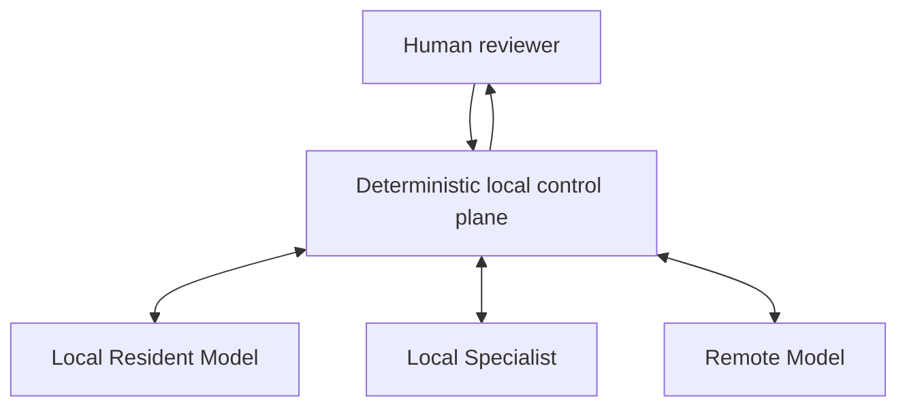

# Dexinode Hybrid Resident-Agent Architecture Hypothesis

- 版本：research hypothesis v0.1-draft
- 研究截止：2026-08-10
- 狀態：human-reviewed research hypothesis；**不是 bounded architecture specification，也不是已驗證 architecture**
- 前提：Dexinode 是待證偽假說；local-first，不是 local-only
- Human decision：component evidence 足以進入一份可證偽的 bounded specification；integrated configuration evidence 仍缺

## 0. Hypothesis statement

> 對一個「可界定、可回復、至少部分可由 deterministic verifier 驗證」的真實工作區域，可信的本地 control plane 能保存 workspace、memory、identity mapping、credentials、policy、task state 與 audit；一個 4B–8B 級 Local Resident Model 在 16K–32K working packet 上處理日常語意判斷，並把窄 contract 交給 Local Specialist，只有超出能力／風險／context envelope 的部分才交 Remote Model。Remote 只回 declarative recommendation 或待驗證 artifact；本地端驗證、整合、還原與執行。若這種完整 configuration 能降低 active human burden、remote disclosure或變動成本而不增加未攔截重大錯誤，則存在可信的 Minimum Viable Resident Core region。

這個 statement 的證據狀態是 `PARTIALLY SUPPORTED`，不是已成立 architecture：component-level evidence 存在，integrated configuration evidence 尚缺。

Resident Core 沿用本輪定義：

`Local general model + memory + context orchestrator + tools/verifiers + task state`

它不等於單一 checkpoint，也不擁有越權執行能力。

## 1. Trust／capability topology

關係的重點不是呼叫順序，而是 authority：

- **Deterministic local control plane** 是唯一持有 raw workspace、canonical memory、identity restoration map、credentials、policy enforcement、tool execution與 audit authority 的元件。
- **Local Resident Model** 取得 bounded working packet，提出澄清、分解、context relevance、可逆 plan與 integration judgment；它不能繞過 control plane。
- **Local Specialist** 只取得其 task contract 所需 packet與 capability handle，正確拒答／要求澄清／升級是正常成功路徑。
- **Remote Model** 被視為能力強但在 privacy與authority上不受信任的 advisor／artifact producer；不取得 credentials、restoration map、整份 history或直接執行權。
- **Human reviewer** 對不可逆／高損失／規格歧義／低信心 integration 保留決策權。

## 2. Responsibility matrix

| 功能 | Deterministic local software | Local Resident Model | Local Specialist | Remote Model | Human reviewer | Evidence | Uncertainty | 主要 failure mode |
|---|---|---|---|---|---|---|---|---|
| intent clarification | 保存原始請求、schema、required fields；判斷欄位缺失 | **主責語意澄清**；提出最少問題與選項 | 僅在自身 contract 缺欄時回 structured `need_clarification` | 可對高複雜規格提出建議，不直接問取不必要私密資料 | 高風險 intent／價值衝突時確認 | Fara／AgentCPM 的 ask／need-feedback schema `C/D`；HCI evidence | 小模型能否辨識隱含 constraint `OPEN` | 自信地猜測未提供需求；反覆追問增加 burden |
| task decomposition | 驗證 DAG schema、dependency、capability與budget；保存版本 | **主責 bounded decomposition**；每步標 contract／risk／verifier | 回報自身可接受的子任務邊界 | 只對超出 local reasoning 的子問題回 declarative decomposition候選 | 跨部門／不可逆拆分時核准 | OneFlow／Agentless／LoopsBench `A`；PlanTwin `B` | 4B–8B在真實 legacy task的planning fidelity `OPEN` | 錯誤分解擴大；漏依賴；graph無限增長 |
| memory write／read／update | **canonical authority**：append log、DB transaction、version、ACL、TTL、tombstone、conflict、provenance、rollback | 提出 extract／merge／forget候選；讀取 conflict set並調和，不可直接覆寫 source | 可寫入 task-scoped observation候選，必附receipt | 不可直接讀寫 canonical memory；只接收 packet，回傳待驗證 knowledge/artifact | 可更正／撤銷／標 authority；敏感 retention決策 | Agent-native comparison、LongMemEval-V2、MemSecBench `A`；LightMem／DimMem `B` | general project/action memory仍 `OPEN` | summary取代raw source；stale truth；poison持久化；假 forget |
| context selection | ACL、hard filters、token budget、recency／version、dedupe、source diversity | **主責 semantic relevance與conflict surfacing**；不得隱藏 uncertainty | 只選其 contract內可用 features／examples | 可請求某種資訊類型；不得自行 browse raw local state | 對高敏感 disclosure或漏關鍵context做抽查 | LongMemEval-V2／MemoryAgentBench `A`；PrivScope／PlanTwin `B` | reader reconciliation與SLM selector reliability `OPEN` | 命中錯版本；壓縮掉constraint；over-disclosure |
| context packet compilation | **主責編譯**：typed schema、source pointers、token計數、pseudonyms、capabilities、budget、checksums | 排序／摘要候選；說明刪除項與uncertainty | 驗證 packet schema 是否符合自身介面 | 只取得最小 task packet；可回 `insufficient_context` | 高敏感 packet可要求preview／approve | PlanTwin／PrivScope `B`；LongMemEval-V2 `A` | task sufficiency跨domain未建立 | packet看似完整但缺硬constraint；摘要引用漂移；累積揭露 |
| pseudonymization／restoration | **唯一 authority**：deterministic identifier map、scope、expiry、collision check；本地restore | 只標語意類別／necessity，不能看到完整mapping | 只用opaque IDs | 只用opaque IDs；不得要求mapping | 特例／法規敏感資料核准 | PrivScope／PlanTwin `B`；PCC `C` | 跨session linkage與結構re-identification仍 `OPEN` | collision、錯restore、semantic clues洩漏、multi-turn linkage |
| tool selection／execution | 驗證allowlist、arguments、permissions、rate/budget；**唯一實際執行／sandbox authority**；產生receipt | 選 tool候選與arguments；解讀observation | bounded tool-policy specialist可提 action；不得越權 | 可產生 tool-call proposal／artifact；不能持credentials或直接執行 | 不可逆／高損失action approval | ReAct／SWE-agent／CaMeL `A`；xLAM／GUI model `C/B` | real API failure／clarification／abstention資料不足 | tool hallucination、argument錯誤、prompt injection、unauthorized side effect |
| planning | 檢查 legal transitions、preconditions、risk、budget、termination；版本化plan | **主責日常可逆 plan**，以current packet運作 | 針對窄domain回局部 plan/action | 對高複雜／跨domain回建議plan，不接觸raw state | 高風險或價值權衡核准 | Agentless／OneFlow／Harness Evolution `A`；PlanTwin `B` | Minimum Viable Resident plan region `OPEN` | planning illusion；loop；remote plan依賴未揭露細節 |
| verification | **主責 deterministic ladder**：schema、static analysis、compiler、tests、DB constraints、policy、artifact diff | 解讀失敗、提出修復；不能覆蓋hard failure | critic/reward specialist作補充 | 可 self-check／提出tests，但輸出視為untrusted | 沒有可靠verifier或嚴重風險時最終判斷 | CRITIC、SWE-agent、WebArbiter `A/B`；intrinsic self-correction負證據 `A` | open-ended quality verifier仍 `OPEN` | noisy verifier破壞正確artifact；LLM judge bias；false pass |
| failure recovery | checkpoint、transaction rollback、retry budget、quarantine、circuit breaker、resume receipt | 診斷候選、選擇下一個可逆策略；同failure不可無限重試 | 回 structured refusal／failure signature | 可提供第二意見或replacement artifact | repeated failure、不可逆損失、scope改變時介入 | LoopsBench／SWE-Effi／MemSecBench `A` | root-cause correctness、human interruption cost `OPEN` | dead loop、budget exhaustion、污染memory、silent partial completion |
| escalation | hard triggers：capability missing、context/risk/budget threshold、verifier failures；記錄reason | calibrated abstain／uncertainty、提出最小remote subtask | 正確拒答／escalate即成功路徑 | 只處理被委派subtask | 核准敏感remote disclosure或scope expansion | routing literature已支持complementarity但 Gate B顯示domain routing不足；MAI DCC `C` | cheap `P(success)` prediction仍 `OPEN` | 過早remote化失去local價值；過晚升級浪費time；domain label誤作success |
| final integration | 驗證所有artifact IDs、tests、policy、restoration、diff、provenance；原子寫入 | **主責語意整合與對user說明**；明示未解項 | 只回bounded artifact，不主導全局 | 回候選artifact／analysis，不直接寫workspace | 高影響結果／ambiguous tradeoff sign-off | LongMemEval-V2 reader gap `A`；coding test loops `A` | small resident跨artifact reconciliation `OPEN` | 各部分正確但整體衝突；錯restore；隱藏fallback |
| audit logging | **唯一 authority**：request、packet hash、model/revision、tool calls、budgets、receipts、decisions、redactions；敏感分層 | 產生可讀 rationale summary，不能刪改log | 附 model output／confidence／refusal code | 附 provider/model ID與response receipt | 可閱覽、註記、要求retention／deletion | production agent telemetry、PCC transparency `C`；reproducibility規範 | rationale是否忠實 `OPEN` | log洩密；不可重現；模型rationale被當真實因果 |

## 3. Minimum Viable Resident Core region（尚待證）

### 3.1 Credible region

目前 evidence 容許但尚未證實的最小區域是：

- **Model scale**：4B–8B dense general／instruction model；本輪不指定最終 checkpoint。
- **Concrete metadata candidate, not selection**：Qwen3.5-4B 的完整artifact約5B，具native tool use與vendor TAU2/BFCL signal；但沒有memory-integrated evidence，且官方建議complex thinking至少保留128K，因此尚不能證明本輪16K–32K envelope。
- **Working set**：16K–32K target；64K以上原則上回到 retrieval／partition／summary，而非直接擴張 prompt。這是 v0.1 assumption，不是科學共識。
- **Task shape**：bounded contract、已知 tools、可回復 side effects、至少一層 independent verifier、可接受 clarification／abstention／remote escalation。
- **Memory**：raw/project state在模型 context外；resident只看 versioned packet與source pointers。
- **Loop**：deterministic state machine + verifier-feedback；預設不使用 free-form reflection graph或 homogeneous multi-agent debate。
- **Remote frequency**：不是每步都用；remote只處理缺少 local capability、複雜整合、超 envelope或反覆 verifier failure的subtask。
- **Human boundary**：不可逆、高損失、價值衝突、規格歧義或無可靠verifier時介入。

### 3.2 不在 credible region 內

- 以 1M native context直接吞入整個 legacy repo／history，期待可靠理解。
- 讓 Resident Model同時成為 memory source of truth、credential holder、policy judge與tool executor。
- 以 BFCL syntax accuracy代表真實 tool workflow成功。
- 以 active 3B 宣稱 35B／80B MoE 是 absolute-small consumer model。
- 讓 remote model直接寫入 canonical memory、取得restoration map或執行不可逆action。
- 以 LLM self-critique作唯一 verifier。
- 用多角色／多agent身份取代 independent evidence。

## 4. Memory 與 context hypothesis

### 4.1 Canonical／derived／working 三層

| 層 | 內容 | 可變性 | 模型可否直接修改 | 安全／復原要求 |
|---|---|---|---|---|
| Canonical source layer | raw events、files/Git、tool receipts、human decisions、external source snapshot | append／version／tombstone | 否 | encryption、ACL、hash、snapshot、rollback、retention |
| Derived memory layer | typed facts、entities、summaries、procedures、failure signatures、indexes | 可重建、可失效 | 只可提候選 | 每項source pointers、extractor/model revision、trust、valid time |
| Working packet layer | current goal、constraints、selected evidence、capabilities、budget、open conflicts | ephemeral | resident可建議調整；compiler決定 | token/schema validation、disclosure log、task expiry |

此分層回應三個已觀察問題：summary loss、stale/conflicting memory、persistent poisoning。刪除一個derived summary不能視為安全forget；真正復原需要撤銷source trust、quarantine其後代、重建indexes／packets並保留audit。

### 4.2 Packet contract（概念，不是正式 schema）

每個 resident／specialist／remote packet至少應能表示：

- bounded goal與明確 non-goals
- hard constraints、risk class、allowed side effects
- selected evidence及 immutable source pointers／versions
- conflicts、staleness、unknowns；不得只給單一合成truth
- exposed tool/capability schemas，而不是 raw credentials
- token／step／retry／latency／disclosure budget
- expected artifact schema與available verifier
- stop、clarify、abstain、escalate conditions
- pseudonym scope；remote packet不含restoration mapping

Evidence 支持「這些資訊類型可有助控制」，但不支持本欄位集合已最佳化；因此這不是 frozen interface。

## 5. Loop 與 verification hypothesis

### 5.1 Default control pattern

`compile packet → propose action/artifact → deterministic validation → execute in bounded environment → observe receipt → accept / one bounded repair / escalate`

這不是 acceptance flow；只是由 Agentless、OneFlow、SWE-agent、CRITIC及負面 self-correction研究導出的最小架構假說。

### 5.2 Verification ladder

1. schema／type／required-field validation
2. capability／permission／risk／budget policy
3. static parsers、compiler、linters、DB constraints、signatures
4. sandbox／unit／integration／simulation tests
5. local specialist critic／reward model（只作補充）
6. remote second opinion或alternative artifact
7. human review

低層 hard failure 不得被高層 LLM judge 覆蓋。若只存在 subjective judge，task contract應視為高不確定，不能自動執行重大不可逆action。

### 5.3 Termination invariants

- 每個 subtask有 wall-clock、step、token、retry與tool-call上限。
- 同一 failure signature重現時，不允許只換措辭重試；必須改 evidence／strategy或升級。
- verifier由 pass→fail 的 regression 必須阻止整合並能回到 last-known-good artifact。
- remote failure不得自動擴張 disclosure；新的 context request要重新過local policy。
- fallback與human intervention都是正常 terminal states，不是隱藏失敗。

## 6. Hybrid disclosure／execution boundary

### 6.1 必須 local 的資料與 authority

- raw workspace與長期history
- canonical memory與provenance graph
- pseudonymization/restoration mapping
- tool credentials、secrets、permissions
- disclosure ledger與跨回合budget
- policy、loop budget、stop／resume state
- actual tool execution、artifact write、rollback
- audit logs及其敏感度分層

### 6.2 Remote 可見與可回內容

Remote 最多應取得：task goal、去識別化必要constraints、typed abstract state、bounded source excerpts、opaque object IDs、capability catalog、artifact schema、verifier feedback與budget。Remote 可回：plan proposal、patch、query、candidate set、explanation、test suggestion或structured refusal。

Remote 不可回傳一個「已執行」宣告來替代 local receipt；也不可要求 credentials／mapping來繞過 local capability interface。

### 6.3 Evidence boundary

- PrivScope／PlanTwin 提供 task-scoped disclosure 的 `B` 級正面訊號，但前者只有 medical booking，後者的 60 tasks／PQS 是作者設計。
- PlanTwin deterministic projection可低於1ms，optional SLM semantic extraction卻需13–34s；PrivScope 3B default約3.13s。故「local privacy manager幾乎免費」不成立。
- MemSecBench 的 poisoning persistence表明最小揭露不能取代 memory trust controls。
- Apple PCC 顯示 stateless remote、attestation、no privileged runtime access可成 production boundary，但它不證明 task packet已最小化，也不證明 local model能力。

## 7. Specialist contracts 與 fallback

| Specialist class | 接收 | 回傳 | Local verifier | 合理成功狀態 | 目前 evidence |
|---|---|---|---|---|---|
| function/tool | function schemas、current arguments、constraints | typed call／clarify／abstain | schema、allowlist、dry-run、tool receipt | valid call、clarification、escalation | FunctionGemma／xLAM；syntax強於action evidence |
| GUI | latest screenshots／accessibility tree、goal、safe action set | one action／ask／pause／done／impossible | element existence、sandbox、critical-action policy、state diff | action accepted、safe pause、human takeover | MAI-UI-2B end-to-end signal；AgentCPM static |
| coding／repo | issue contract、selected code/provenance、tests、sandbox tools | patch／test／failure diagnosis／abstain | compiler、unit/integration tests、diff policy | tests pass、one small edit、escalation | SERA-8B end-to-end；8B card 的 80GB 建議未被論文 hardware 章節獨立佐證 |
| search／research | bounded question、source policy、search/fetch tools、citation schema | evidence bundle、claims、uncertainty | source whitelist、citation resolution、dedupe、fact checks | supported answer、insufficient evidence | AgentCPM-Explore signal；summarizer circularity |
| verifier／critic | artifact、task contract、observations；無答案洩漏 | pass/fail/uncertain + localized reason | deterministic cross-check／calibration | correct reject、correct accept、uncertain→escalate | WebArbiter augmentation；Best-of-5／remote policy confound |
| memory/context | raw candidate spans、schema、task goal、trust metadata | typed facts／relevance／necessity／conflict | source-span match、schema、version、privacy rules | valid candidate、conflict surfaced、abstain | LightMem／DimMem／PrivScope；project action仍open |

## 8. Human-review hypothesis

Human review 不應被當成無限免費 fallback。至少分記：

- intent clarification time
- packet／disclosure approval time
- artifact review time
- repair/edit time與edit magnitude
- interruption／context-switch time
- irreversible-action approval
- post-failure recovery time

[METR experienced OSS RCT](https://metr.org/blog/2025-07-10-early-2025-ai-experienced-os-dev-study/) 顯示 experienced developers在自己的 mature repos使用 frontier AI仍可能慢19%，且主觀以為快20%。因此「一次小改」與「願意再用」必須直接詢問／觀察，不能由 pass@1或token savings推論。

## 9. 可觀察指標（measurability，不是 criteria）

| Dimension | Configuration-level observable |
|---|---|
| quality | contract success；first-pass／one-small-edit accepted；reverted output；abstention precision／recall |
| human burden | active minutes by phase；clarification count；review/edit time；takeover／fallback rate；willingness and actual reuse |
| latency | local packet P50/P95；model/tool/verifier分段；end-to-end P50/P95；human waiting vs active time |
| variable cost | local wall time／energy；remote input/output tokens；calls、retries、pass@k；hardware amortization另列 |
| privacy | raw／profile／prior-workflow leakage；re-identification；cross-turn cumulative disclosure；restoration error |
| safety | blocked vs escaped high-severity actions；rollback success；poison persistence；privilege／credential exposure |
| reliability | dead-loop、budget exhaustion、tool/API failure、recovery success、regression、environment drift |
| provenance | source coverage、stale-source rate、conflict surfaced、packet-to-source traceability |

這些量原則上都可記錄，但文獻沒有支持 70%／-30%／-50% 是通用 threshold；它們仍只是 Dexinode v0.1 screening assumptions。

## 10. Uncertainties 與 falsifiers

### 10.1 主要不確定性

1. 4B–8B general model是否能在真實 project state上可靠做context relevance、conflict reconciliation與final integration。
2. memory manager若不使用 remote frontier backbone，quality loss是否抵銷節省的context／privacy價值。
3. published specialists在8K–32K packet、低retry、固定latency下是否仍有end-to-end advantage。
4. local specialist interface conversion與verification成本是否吃掉model efficiency。
5. task-scoped disclosure是否能跨多project、多turn、adversarial content保持utility與低leakage。
6. local-first workflow是否真的降低active human time，而不是把成本搬到packet approval、review與recovery。

### 10.2 會推翻／迫使 pivot 的觀察

- 每個非平凡步驟都要 remote model重做resident的memory、planning或integration，否則成功率不可接受。
- local context selector反覆漏掉hard constraints，且deterministic safeguards無法捕捉。
- local specialists在同contract、budget、harness下沒有高於simple fixed pipeline + remote model的可辨識價值。
- verification／repair造成的latency與human burden超過local inference／privacy收益。
- task packet最小化在真實workflow造成不可接受utility loss，或仍可高率re-identify。
- memory poisoning無法由quarantine／rollback／re-index回復，而必須信任同一模型「自我遺忘」。

若只剩第一項 architecture value——本地保管state、credentials、policy與audit，而推理主要在cloud——最合理結論將是 `PIVOT TO LOCAL CONTROL PLANE`，不是繼續主張 Local Resident Model承擔主要推理。

## 11. Hypothesis-level conclusion

- **可信 local control plane**：`ESTABLISHED` 為合理安全／狀態責任邊界，但尚未量化其相對產品價值。
- **absolute-small specialists**：`PARTIALLY SUPPORTED`；至少 GUI、tool、coding三類有end-to-end signal，部署／license／harness缺口各異。
- **Local Resident Core**：`OPEN`；component decomposition可信，整合證據不足。
- **memory/context降低所需scale**：`PARTIALLY SUPPORTED`；能降低輸入與提高部分memory quality，但常暗中依賴大model/controller。
- **minimal loop + deterministic verifier**：`ESTABLISHED` 為比複雜graph更可信的預設；對open-ended tasks仍有限。
- **整體 architecture hypothesis**：component evidence 足以支撐撰寫一份可證偽的 bounded architecture spec；這個 proceed-to-spec 判定不代表 integrated architecture 已驗證。
